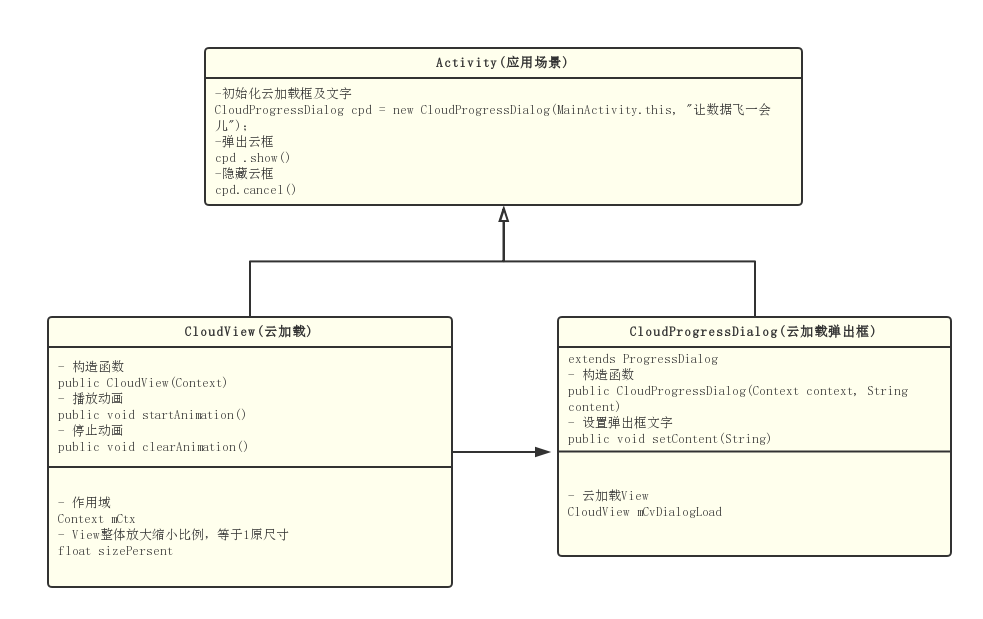

## CloudView简介
* 来自团队UI的创意，一朵祥云中5个齿轮转呀转，寓意制造业与数据云的融合，轻量级可以自定义缩放比例。
* 腾讯bugly内测平台的文件上传加载交互竟然与这惊人相似，但是他们的效果就蓝瘦香菇了。。好事者可以去看看

## 关键构图


## 效果图


## 使用方法
* 添加依赖
```
allprojects {
		repositories {
			...
			maven { url "https://jitpack.io" }
		}
	}
```

```
dependencies {
	        compile 'com.github.tengpangzhi:cloudview:v1.0'
	}
```

* 使用弹出加载框
```
CloudProgressDialog cloudProgressDialog = new CloudProgressDialog(LoginActivity.this,"loading.......");
cloudProgressDialog.show();
```
* 使用云动画view
```
<com.tengpangzhi.cloudview.CloudView
        android:id="@+id/cvDialogLoad"
        android:layout_width="wrap_content"
        android:layout_height="wrap_content"
		tools:sizePersent="0.5"/>
```

v1.0.1
增加自定义背景设置
----
### 关于作者
* 公众号（欢迎关注骚扰）一位胖纸的自我修养

* Email： <2740425104@qq.com>
  有任何建议或者使用中遇到问题都可以给我发邮件
